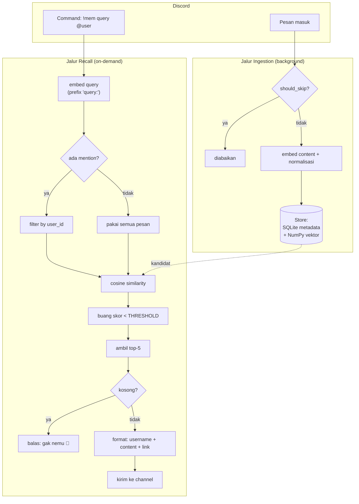

# MemIR — Plan & Design Doc (v1)

> Discord bot untuk semantic memory/search di chat. Tujuannya: gantiin keyword matching bawaan Discord dengan pencarian berbasis makna (semantic).

---

## 1. Ringkasan Konsep

MemIR (Memory + Information Retrieval) adalah Discord bot yang menyimpan pesan-pesan di server lalu memungkinkan pencarian **berdasarkan makna**, bukan kata kunci persis. Contoh: cari "deadline" tetap nemu pesan yang nulis "tenggat waktu" atau "due date".

Search bawaan Discord cuma keyword matching + filter biasa. MemIR upgrade ini jadi semantic search lewat embeddings + similarity.

---

## 2. Scope v1 (keputusan yang sudah diambil)

| Aspek | Keputusan | Catatan |
|---|---|---|
| Tipe sistem | Server-wide semantic search | Awalnya dikira per-user, ternyata lebih tepat server-wide |
| Cakupan data | 1 server, ribuan pesan | Skala kecil, infra ringan cukup |
| Representasi memory | Raw message (tanpa summarization) | Simpel; olahan/fakta ditunda ke versi berikutnya |
| Trigger recall | On-demand (user manggil command) | Bukan auto-recall |
| Scoping author | `user_id` = filter opsional, bukan partisi | Bisa cari semua pesan, atau filter by author tertentu |
| Privacy/permission | Diabaikan untuk v1 | Server sirkel/geng, dianggap aman |
| Pembatasan hasil | top-k + minimal threshold | k = 5, threshold dikalibrasi |

**Contoh pemakaian:**
- `!mem proyek deadline` → cari di seluruh pesan server
- `!mem proyek deadline @Andi` → cari, difilter khusus pesan si Andi
- `!reindex` → backfill pesan history channel (lihat §5c)

---

## 3. Diagram Arsitektur

### Alur tingkat tinggi



### Catatan baca diagram
- **Dua jalur independen.** Ingestion jalan terus di background tiap ada pesan; recall cuma jalan saat ada command. Keduanya cuma ketemu di `Store`.
- **Store dipakai dua arah:** ingestion menulis, recall membaca (garis putus-putus = baca kandidat).
- **Titik kalibrasi** ada di node `THRESHOLD` — ini konstanta yang bakal sering disetel di awal.

---

## 4. Skema Data

Tiap pesan disimpan sebagai satu record:

```
{
  id:         string        // message ID Discord (unik, anti-duplikat / idempotent)
  user_id:    string        // author — FILTER opsional (bukan partisi). Sumber kebenaran.
  username:   string        // buat display "siapa yang ngomong". Bisa berubah, jangan dipakai filter.
  channel_id: string        // konteks; v1 belum dipakai filter tapi murah disimpan
  content:    string        // teks mentah pesan
  timestamp:  int           // epoch; buat sorting & recency
  embedding:  float[384]    // vektor hasil embed content (dinormalisasi!) — disimpan sbg BLOB
}
```

**Catatan desain:**
- `channel_id` dan `timestamp` disimpan walau v1 belum pakai — murah sekarang, mahal kalau harus re-embed semua pesan gara-gara lupa nyimpan.
- `id` pakai message ID asli Discord biar idempotent: kalau bot restart & re-ingest, gak dobel. Pakai `INSERT OR IGNORE` di SQLite.
- `user_id` = sumber kebenaran untuk filter. `username` cuma buat display.
- **Embedding disimpan sebagai BLOB di kolom yang sama** (bukan file `.npy` terpisah). Satu transaksi atomic per pesan → gak ada risiko desync antara metadata & vektor. Saat startup, semua row di-load sekali ke NumPy array in-memory untuk similarity. Lihat §7.

---

## 5. Dua Jalur Alur (dipisah karena trigger beda)

### 4a. Ingestion (background, tiap ada pesan masuk)

```
on_message(msg):
    if should_skip(msg):        # skip pesan bot, command, pesan kosong
        return
    vec = embed(msg.content)    # pastikan hasil dinormalisasi
    store.insert({id, user_id, username, channel_id, content, timestamp, embedding: vec})
```

### 4b. Recall (cuma jalan saat user manggil command)

```
on_command("!mem <query> [@user]", caller):
    qvec = embed(query)
    candidates = store.all()                    # SELURUH server (bukan per-caller)
    if mention:                                  # filter opsional by author
        candidates = candidates.filter(user_id == mention.id)

    ranked = cosine_similarity(qvec, candidates)
    filtered = [r for r in ranked if r.score >= THRESHOLD]   # buang yang ngawur
    top_5 = filtered.sort_desc()[:5]                          # batasi maksimal 5

    if len(top_5) == 0:
        return "Gak nemu pesan yang relevan soal itu 🤷"
    return format(top_5)        # tampilkan: username, content, link ke pesan
```

**Urutan penting:** filter `user_id` dulu (kalau ada mention), baru hitung similarity.

### 4c. Backfill / Reindex (`!reindex`) — on-demand, sekali setup

`on_message` cuma nangkap pesan **baru**. Ribuan pesan lama gak akan keindeks. `!reindex` nyedot history channel biar ada data buat dicari sejak hari pertama.

```
on_command("!reindex", caller):
    count = 0
    for channel in guild.text_channels:
        async for msg in channel.history(limit=None):   # dari paling lama
            if should_skip(msg):
                continue
            vec = embed(msg.content)
            store.insert({...})        # INSERT OR IGNORE → idempotent, aman diulang
            count += 1
    return f"Selesai. {count} pesan terindeks."
```

**Catatan:**
- Idempotent berkat `INSERT OR IGNORE` pada `id` — aman dijalankan berkali-kali, gak dobel.
- Bisa lambat & rawan rate-limit kalau channel besar. v1: jalankan manual sekali. Batch insert + kabari progress tiap N pesan.
- Butuh izin **Read Message History** di channel terkait.

---

## 6. Strategi Pembatasan Hasil: top-k + threshold

Keputusan: **gabungan top-k DAN minimal threshold** (hasil akhir = 0–5 pesan).

**Kenapa bukan fixed top-5 murni?**
Gak bisa bilang "gak nemu apa-apa". Bot selalu maksa balikin 5 pesan walau semuanya ngawur → user ilang kepercayaan.

**Kenapa bukan threshold doang?**
Kalau query pas dengan topik rame, bisa puluhan pesan lolos → kebanjiran.

**Gabungan = threshold buang yang ngawur, top-k batasin yang kebanyakan.**

### Soal nilai THRESHOLD
- Tergantung model embedding. Model e5 cenderung kasih skor tinggi & rapet → threshold beda dari model lain.
- Cara kalibrasi: embed beberapa query uji, bandingkan skor pesan yang KAMU TAU relevan vs yang gak relevan, ambil angka di tengah.
- Titik awal umum: ~0.3–0.5 untuk cosine, lalu disetel.
- **Jadikan konstanta yang gampang diubah** — bukan hardcode nyebar.

### Normalisasi (penting!)
- Normalisasi embedding sebelum disimpan.
- Kalau sudah normalized: cosine similarity = dot product (lebih cepat) dan threshold jadi konsisten.
- Banyak bug "threshold aneh" sebenernya gara-gara lupa normalisasi.

---

## 7. Tech Stack — Final (v1)

Pilihan ini dioptimalkan untuk skala kecil (ribuan pesan, 1 server) dan kemudahan implementasi. Semua bisa di-upgrade tanpa membongkar arsitektur.

| Komponen | Pilihan | Alasan |
|---|---|---|
| Bahasa | **Python** | Ekosistem ML/embedding paling matang; mayoritas reference pakai ini |
| Discord lib | **discord.py** | Standar de-facto, dukungan event `on_message` & slash command bagus |
| Embedding model | **`intfloat/multilingual-e5-small`** (via `sentence-transformers`) | Multilingual (ID+EN), 384-dim, ringan & jalan di CPU. Naik ke `-base`/`-large` kalau kualitas kurang |
| Index/similarity | **NumPy in-memory + cosine** | Di skala ribuan pesan, gak butuh vector DB. Cepat & nol infra |
| Persistensi | **SQLite** (metadata + vektor sbg BLOB) | Satu file, satu transaksi atomic per pesan → anti-desync. Vektor di-load ke NumPy in-memory saat start |

### Catatan penting per pilihan

- **Model e5 butuh prefix.** Family e5 minta input diberi prefix: `"query: ..."` untuk query dan `"passage: ..."` untuk dokumen yang diindeks. Kalau lupa, kualitas anjlok. Ini sering jadi sumber bug diam-diam.
- **`-small` dulu.** 384-dim sudah selaras dengan skema data (`float[384]`). Kalau recall kerasa kurang pinter, naikin ke `-base` (768-dim) — ingat update dimensi di skema.
- **Persistensi satu tabel.** Metadata + embedding (BLOB) di satu row SQLite → satu transaksi atomic, gak ada risiko mapping geser kalau crash di tengah jalan. Saat startup, `SELECT` semua row sekali, susun jadi NumPy array `(N, 384)` di memori untuk similarity. `id`/`user_id` tetap bisa di-query/filter lewat SQL.

### Jalur upgrade (kalau sudah perlu)
- Pesan tembus puluhan/ratusan ribu & lambat → pindah ke **FAISS** atau **Qdrant**.
- Mau hasil lebih presisi → tambah **hybrid search** (gabung dengan BM25/keyword via `rank_bm25`).
- Butuh akurasi makna lebih tinggi → naik tier model e5 atau ganti ke model embedding yang lebih besar.

---

## 8. Reference Proyek (hasil riset)

| Proyek | Relevansi | Yang bisa dicuri |
|---|---|---|
| **f0lio/discontext** | Paling dekat spiritnya. Semantic search Discord pakai embeddings + Qdrant | Pola abstraksi swap embedding/DB. (Author bilang WIP, contek pola bukan kode mentah) |
| **nath54/SemanticSearch-DiscordBot** | Hybrid search + local embedding (`multilingual-e5-large`) | Pola hybrid (semantic+keyword) & contoh pakai model multilingual lokal |
| **MissingNO123/Sentence_Embeddings** | POC paling minimalis, mirip arsitektur v1 | Bukti vector DB belum wajib di skala kecil — sentence_transformers + cosine cukup |
| **reality-comes/GPT-4-Discord-Bot-Long-Term-Memory** | Memory layer "penuh": embed → log → summarize → notes + auto-recall | Peta jalan untuk v2 (summarized memory + auto-recall), BUKAN untuk v1 |

---

## 9. Backlog / Ide untuk Versi Berikutnya (sengaja ditunda di v1)

- **Summarized/derived memory** — destilasi pesan jadi fakta terstruktur, bukan raw.
- **Auto-recall** — bot manggil memory otomatis pas mau jawab, tanpa command.
- **Hybrid search** — gabung semantic + BM25/keyword.
- **Filtering noise** — buang pesan receh ("wkwk", "ok") via minimum panjang token / threshold (sebagian ke-handle threshold similarity).
- **Permission-aware recall** — hormati akses channel kalau bot dipakai di server yang lebih terbuka.
- **Chunked conversation** — gabung beberapa pesan jadi 1 unit konteks sebelum embed.

---

## 10. Rencana Eksekusi (siap ngoding)

### Struktur file
```
MemIR/
├── .env                 # DISCORD_TOKEN (gitignored)
├── .gitignore
├── requirements.txt     # discord.py, sentence-transformers, numpy, python-dotenv
├── config.py            # THRESHOLD, TOP_K, MODEL_NAME, PREFIX, DB_PATH — konstanta kalibrasi
├── embedder.py          # wrap e5: prefix "query:"/"passage:" + normalisasi
├── store.py             # SQLite (metadata+BLOB): insert (INSERT OR IGNORE), load→NumPy, filter
├── memir.py             # bot: on_message (ingest), !mem (recall), !reindex (backfill)
└── README.md
```

### Urutan build
1. `config.py` — semua konstanta di satu tempat (THRESHOLD ~0.3–0.5 awal, TOP_K=5).
2. `embedder.py` — tes standalone: pastikan output ter-normalisasi (`norm ≈ 1.0`) & prefix benar.
3. `store.py` — skema tabel, insert idempotent, load semua row ke NumPy `(N, 384)` saat start.
4. `memir.py` — wiring: ingest di `on_message`, `!mem` recall, `!reindex` backfill.
5. Tes manual di server Discord + kalibrasi THRESHOLD pakai query uji.

### Gotcha wajib diingat saat ngoding
- **Message Content Intent** harus diaktifkan di Discord Developer Portal, kalau tidak `msg.content` selalu kosong (ingestion & `!mem` mati diam-diam).
- **Prefix e5:** `passage:` saat ingest/index, `query:` saat search. Salah/lupa → kualitas anjlok tanpa error.
- **Normalisasi sebelum simpan.** Kalau sudah normalized, cosine = dot product & threshold konsisten.
- **`should_skip`:** skip pesan bot, pesan yang diawali PREFIX (command), pesan kosong/embed-only.
- **Token di `.env`**, jangan hardcode. `.gitignore` wajib memuat `.env`, `*.db`, `__pycache__/`.
- **`!reindex` butuh izin Read Message History** & bisa kena rate-limit di channel besar.

---

## 11. Status

- [x] Scope & konsep v1 disepakati
- [x] Skema data (embedding = BLOB di SQLite)
- [x] Alur ingestion, recall (`!mem`), backfill (`!reindex`)
- [x] Strategi top-k + threshold
- [x] Diagram arsitektur visual
- [x] Finalisasi tech stack
- [x] Keputusan eksekusi: storage BLOB, `!reindex`, command `!mem`, prefix-based
- [x] Struktur file & urutan build
- [ ] Implementasi (tahap ngoding — siap dimulai sesi berikutnya)
